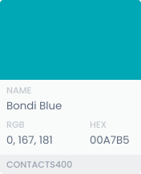
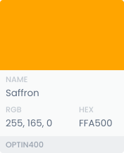
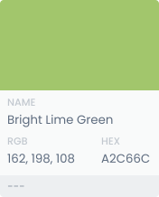
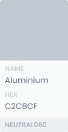
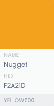
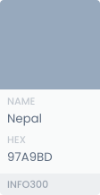

# Color
The product is build on a simple color coding. Each product has its own primary color and they all share secondary and utility colors.

## Service Colors
Service colors should be easily distinguishable from each other and utility colors. Inside each service these colors are used for primary actions, progress indications and primary accents for the service.

### Candidate Colors
These are the colors that have potential to be used in the upcoming projects.

## Secondary Colors
To keep consistency and simountaneously complement each and every one of service colors we are using one dark and one light secondary color.

## Utility Colors
Utility color palette contains green, yellow, red and a neutral shade of grey and blue. These colors carry different meanings depending on the context.

## Neutral Colors
Neutral colors have various level of saturation that have different uses across our services. Typically they are used for text and subtle backgrounds where attention is not needed.
### Dark Neutrals
Dark neutrals are used generally for secondary actions or as a background color. Low dark neutrals NEUTRAL500 - NEUTRAL700 can be used for headings.

### Mid Neutrals
Consider using mid neutrals to create depth and to create hierarchy in typography.

### Light Neutrals
Light neutrals are used in subtle backgrounds such as text fields and tags. They can also be used to create a feeling of unavailablity.

## Extended Colors
Here you will find all the usable tints and shades of each color in our system. Please follow the guidelines using following colors. Most of the colors are mainly found in illustrations.
### Services

### Utility

